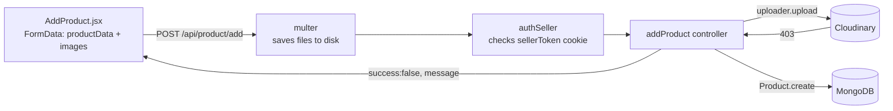

# Learnings Log

A running log of mistakes made in this project and what they taught. Newest entries go at the top of each section. Git history is the source for entries before 2026-09-28.

---

## Lessons learned

### 2026-09-28: Add Product fails with a 403

- **Read the error before touching code.** The toast said `Server returned unexpected status code - 403`. That wording comes from the Cloudinary SDK, not from our backend (every one of our routes answers with status 200 and `success: false`). One look at the message would have shown the failure was in the image upload, not in auth or the form.
- **A "success: false" toast can hide an error from a third-party service.** Our controllers `catch` everything and send `error.message` back. So a toast can show another service's error message word for word. Search the message text to find where it came from.
- **Know what an import actually gives you.** `connectCloudinary` is a setup function that runs once in `server.js`. It is not the Cloudinary client, so `connectCloudinary.uploader` is `undefined`. Import the library itself (`import { v2 as cloudinary } from "cloudinary"`) wherever you call it.
- **A `required` field must be filled in by someone.** `inStock` was `required: true`, but neither the form nor the controller ever set it. If a value always has an obvious starting value, use `default:` in the schema.
- **Filename case matters on Linux, even though your Mac ignores it.** The route imports `productController.js`, but the file is `ProductController.js`. It works on a Mac and crashes on a Linux server. Keep filenames and imports identical, and use one naming style (all lowercase camelCase).
- **Order of middleware matters.** `upload` running before `authSeller` means files from people who aren't logged in get written to disk before they're rejected. Check who is making the request first, then do the expensive work.
- **Read the library's function signature.** `upload.array(["images"])` should be `upload.array("images")`. The array form works only by accident.
- **Keep React state the same type.** `files` starts as `[]`, so reset it with `setFiles([])`, not `setFiles("")`.
- **Check input before sending it.** Empty image slots were being sent as the text `"undefined"`, and a product could be saved with no images at all.
- **Test the outside service on its own.** One `curl` to Cloudinary showed the network and cloud name were fine, which ruled those out in seconds. Isolating one layer at a time is faster than guessing.

### Before 2026-09-28 (from git history)

- **A deleted secret is still in git history.** `Frontend/.env` was committed in `1b79560`/`8559a4c` and removed later. `Backend/.env`, containing `MONGO_URI`, was committed in `2386412` and removed in `f049868`, and it is still readable in the pushed history. Deleting a file does not un-leak it. **Change (rotate) the MongoDB password.**
- **Set up `.gitignore` before the first commit.** `.env`, `node_modules` and `.DS_Store` were all committed at some point. Once a file is tracked, adding it to `.gitignore` does nothing until you run `git rm --cached <file>`. `.DS_Store` is still tracked for exactly this reason.
- **Never commit `node_modules`.** `Backend/node_modules` was committed and later deleted, which took about 675k lines of noise (`f049868`, `88603e8`). `npm install` recreates it from `package-lock.json`.
- **Renaming a folder only by capitalisation confuses git on a Mac.** `ddc7162` renamed `Frontend` to `frontend` in git, but on disk the folder is still `Frontend` (and `Backend`). The paths git tracks and the paths on disk disagree, and this breaks on Linux or CI. Rename in two steps (`git mv Frontend tmp && git mv tmp frontend`) and pick one spelling.
- **Commit messages should say what changed.** Messages like "28 sep updates" and "tryinf prev thing only" make it hard to find which commit caused a bug. Write what changed and why, e.g. "Default inStock to true in Product model".

---

## Code changes

### 2026-09-28: Add Product fix

#### Where the 403 came from



The request got as far as Cloudinary (E). Cloudinary answered 403, and the controller passed that message back to the page. The curl check showed the network and cloud name are fine, which leaves a restriction on the Cloudinary account or API key as the cause.

#### Applied

**`Backend/models/Product.js`**: `inStock` gets a default instead of being required.

```diff
     inStock: {
       type: Boolean,
-      required: true,
+      default: true,
     },
```

**`Backend/controllers/ProductController.js`**: undid the wrong import, so it uses the Cloudinary client again.

```diff
-import connectCloudinary from "../configs/cloudinary.js";
+import { v2 as cloudinary } from "cloudinary";
 ...
-        let result = await connectCloudinary.uploader.upload(item.path, {
+        let result = await cloudinary.uploader.upload(item.path, {
```

#### Applied on 2026-09-29

**`Backend/controllers/ProductController.js` renamed to `productController.js`**, so the filename matches the import. It was done in two steps through a temporary name (`git mv A tmp && git mv tmp B`), because on a Mac git doesn't notice a rename that only changes capitalisation.

**`Backend/routes/productRoute.js`**: fixed the multer argument and check auth first.

```diff
-productRouter.post("/add", upload.array(["images"]), authSeller, addProduct);
+productRouter.post("/add", authSeller, upload.array("images"), addProduct);
```

**`Frontend/src/pages/seller/AddProduct.jsx`**: check the images, skip empty slots, and reset state correctly.

```diff
   const onSubmitHandler = async (e) => {
     try {
       e.preventDefault();
+      if (!files.some(Boolean)) return toast.error("Add at least one image");
 ...
-      for (let i = 0; i < files.length; i++) {
-        formData.append("images", files[i]);
-      }
+      files.filter(Boolean).forEach((file) => formData.append("images", file));
 ...
-        setFiles("");
+        setFiles([]);
```

Verified: `productRoute.js` and everything it imports load without errors in Node, and ESLint passes on `AddProduct.jsx`.

#### Pending

**Outside the code**:
- Check the Cloudinary dashboard for an "untrusted" or "upload disabled" warning.
- Make sure the API key isn't restricted.
- Rotate the MongoDB password.
- Run `git rm --cached .DS_Store`.
